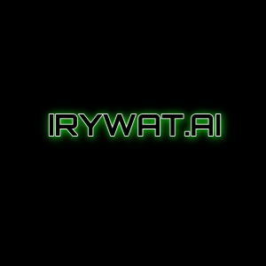

---

<p align="center">
    <!--     You can add your logo here -->
    
</p>
<p align="center">
  <!-- You can add your badges here -->
  <!-- If you have never added badges, head over to https://img.shields.io/badges/static-badge, follow the instructions and generate URL links to add below -->
  
  
  <!--  -->
  
</p>


### :star2: About
- IRYWAT is a platform which is ready to deploy server where you don't have to care much about how you manager traffic and request flow you just need to focus on building your AI microservice and this will provide a communication layer to that AI service
- This is container based so host your models somehere in this world and bring it's IP and perform the business or any other cool logics with IRYWAT


### :books: Index

- [About](#star2-About)
- [Demo](#movie_camera-Demo)
- [HLD](#fire-HLD)
- [Set Up](#outbox_tray-Set-up)
- [Contribute](#building_construction-Contribute)
- [Deployment](#rocket-Deployment)  <!-- - [File Structure](#file_folder-File-Structure) -->
- [Roadmap](#bicyclist-Roadmap)
- [FAQ](#thinking-FAQ)
- [License](#page_facing_up-License)
- [List of Contributors](#people_holding_hands-Our-List-of-Contributors)
- [Contact](#email-contact)


###  :movie_camera: Demo
- here is a recorded video of the APIs from postman.
- one is detector API where we pass an image for registration and other one was the verifier where we send an image for verification.

<p align="center">
    <a href="https://drive.google.com/file/d/17qljgrRdLeeWj_EjRkfj9X07J_Kd5izY/view?usp=sharing">
        
    </a>
</p>


$~$
### :fire: HLD

<p align="center">
    <!--     You can add your logo here -->
    
</p>
<p align="center">
    
###  :outbox_tray: Set up
- These are the steps required to install the project.
- I have built this project on Ubuntu OS but I've not tried installing it in other OS but in that case you can go forward with docker installation.

## Prerequisites
- Docker
- Python >= 3.8

## DataBase setup
- This is a critical step as whole project is based upon this DB installation 
    - `docker network create -d bridge network1`
    - `docker pull ankane/pgvector`
    - `docker run --name pgvector-db --rm -e POSTGRES_PASSWORD=test@123 -p 5432:5432 --network network1 ankane/pgvector`

- Here your DB image is pulled and your container will be up and running with username postgres and password test@123 Now you need to configure it.
- go to shell_scripts/db_setup/ and start this bash script configure_db.sh by 
    - `chmod +x ./configure_db.sh`
    - `./configure_db.sh` 

- Congratulations!!! your DB is ready, you can also connect this DB with pgAdmin to run custom queries.

## Docker installation 
- Now just be in this directory(root) and type one magic command to turn the server on 
    - `docker-compose up`

- In case want to run this application only(not detector & verifier) through docker container then firstly expose your port 5432 to internet using ngrok on which your postgres vectorDB is running then make image of this from dockerfile and then run the container with following commands
    - `docker build -t <name-for-image(foreg: service_manager)> .`
    - `docker run -p 5050:5050 --rm --name <name-for-container> -e NGROK_PORT=<ngrok-port> <name-of-image(foreg: service_manager)>`

- that's it Now you can hit the detector and verifier APIs and take the feel of this powerfull system
 
## Local installation
1. Clone the repo
   ```sh
   git clone https://github.com/yashtiwari1906/AI-Service-Manager.git
   ```
2. ```sh
    cd AI-Service-Manager
    ```
2. Install dependancies
   ```sh
   pip install -r requirements.txt
   ```
3. go to prequisites/detector_verifier_servers/ in another terminal and hit following command to switch on the servers for detector and verifier
   ```sh
   docker-compose up
   ```
4. Now your detector is up at (127.0.0.1:5001/predict) & verifier is up at (127.0.0.1:4001/predict) for predictions you can use https://drive.google.com/file/d/1-5jFNU1p6IkZnRuUXuf0hpqCTLyRIe8L/view?usp=sharing  dummy payload to check them individually

5. Now get back to the main terminal and export an environment variable ENV
    ```sh
    export ENV=local
    ```
6. Now hit the main server by 
    ```sh
    python manage.py runserver
    ```
7. Now you can try this by hitting registration folder for registration of face and verification folder for verification of the face under the ai_service_manager folder in the postman collection attached in this repo

### Request & Reponses
    - you can find postman collection at https://drive.google.com/file/d/15sDPYq4CAaT1pdMViJRhbQXqHPOOjOwV/view?usp=sharing where the request and response are documented
    - but as per general information:
    - if running system from local ip for this server will be 127.0.0.1:8000 otherwise 0.0.0.0:5050 
    two APIs are exposed in this system right now 
        - Registration: 
            - {ip}/api/chehra/register-face/
            - where you need to provide an image file in the request along with name of the face which you want to register
        - Verification:
            - {ip}/api/chehra/verify-face/
            - here you only need to provide an image 

$~$

###  :building_construction: Contribute

`# Contributing

When contributing to this repository, please first discuss the change you wish to make via issue,
email, or any other method with the owners of this repository before making a change.

## Pull Request Process
1. check for the dependancy related stuffs and use docker containers to run microservices used in this project
2. Update the README.md with details of changes to the interface, this includes new environment
   variables, exposed ports, useful file locations and container parameters.
3. Increase the version numbers in any examples files and the README.md to the new version that this
   Pull Request would represent. The versioning scheme we use is [SemVer](https://semver.org).
4. You may merge the Pull Request once you have the sign-off of two other developers, or if you
   do not have permission to do that, you may request the second reviewer merge it for you.
`

**Choose an Issue**

1. Pick an issue that interests you - if you're new, look for `good-first-issue` tags.
2. Read the CONTRIBUTING.md file
3. Comment on the Issue, and explain why you want to work on it
   You can showcase any relevant background information on why you can solve the issue.
    
**Set Up Your Environment**

1. `Fork` our repository to your GitHub account. 
2. `Clone` your fork to your local machine. 
    Use the command `git clone <your-fork-url>`.
3. Create a new branch for your work. 
    Use a descriptive name, like `fix-login-bug` or `add-user-profile-page`.
    
**Commit Your Changes**

- Commit your changes with a _clear commit message_. 
  e.g `git commit -m "Fix login bug by updating auth logic"`.

**Submit a Pull Request**

- Push your branch and changes to your fork on GitHub.
- Create a pull request, compare branches and submit.
- Provide a detailed description of what changes you've made and why. 
  Link the pull request to the issue it resolves. 🔗
    
**Review and Merge**

- Our team will review your pull request and provide feedback or request changes if necessary. 
- Once your pull request is approved, we will merge it into the main codebase 🥳

$~$

### :rocket: Deployment
- you can go in the deployment folder to find the deployment file for the kubernetes deployment of the project.
- Install minikube first and then just deploy every deployment file in it by:
    `kubectl apply -f <file_name.yaml>`
- Then type `minikube ip` this will be your IP and `31111` will be your port which is the nodeport for service-manager-service
- so url in cluster based environment will be `http://<minikube_ip>:31111`
- One thing to remember when your'e estabilishihng the communication between multiple pods try to make sure your'e calling with port not with targetPort or containerPort
- In GKE cluster you've to deploy these `NodePort` as `LoadBalancer` so that you'll have an external IP and you'll call it through `port` not targetPort or NodePort

$~$

<!-- ###  :file_folder: File Structure

- Adding a file structure can help users gain a high-level understanding of your project. 
- If your project has too many files, you can consider showcasing only the main folder paths. 

```
.
├── 
│   ├── api
│   │   ├── favicon.ico
│   │   └── index.html
│   ├── src
│   │   ├── App.css
│   │   ├── App.js
│   │   ├── index.js
│   │   └── logo.svg
│   └── package.json
├── 
│   ├── p
│   │   ├── favicon.ico
│   │   └── index.html
│   ├── src
│   │   ├── App.css
│   │   ├── App.js
│   │   ├── index.js
│   │   └── logo.svg
│   └── package.json
├── .gitignore
├── LICENSE
└── README.md
``` -->

### :bicyclist: Roadmap
Version:0
- [x] Introduction of Concept
- [x] AI Service Manager is born and this is a connector of all the AI microservices
- [ ] Docker-compose for instant replication of the server on a machine
- [ ] Key-Features
    - [ ] Singleton pattern is followed to generate uuid to the request
    - [ ] builder pattern in the detector and verifier microservices
    - [ ] 4-5 sec latency in the first draft

$~$

### :thinking: FAQ
with respect to API there are just two one for detection and storing the identity and another for verification  **toggle lists.** 

<details>
  <summary>Quick Questions</summary>
  
  ### FAQs
  1. DB setup is necessary right now for the project to work
  2. Docker-compose.yml is enough to make this project up and running 
     * But you need to make a docker network because database will be running as a container
     * We'll try in future to remove this dependancy

  <!-- ### Here's the MARKDOWN template to build your own toggle lists
  ```
    <details>
    <summary>Toggle List Example</summary>
    
    ### Heading
    1. ABC
    2. DEF
       * Hello
       * Bye
    </details>
  ``` -->

</details>

<!-- If you have a documentation platform/file, you can change the title to _Documentation_ and add the link for it here. -->

$~$

### :page_facing_up: License
Copyright (c) 2023 Yash

Permission is hereby granted, free of charge, to any person obtaining a copy
of this software and associated documentation files (the "Software"), to deal
in the Software without restriction, including without limitation the rights
to use, copy, modify, merge, publish, distribute, sublicense, and/or sell
copies of the Software, and to permit persons to whom the Software is
furnished to do so, subject to the following conditions:

The above copyright notice and this permission notice shall be included in all
copies or substantial portions of the Software.

THE SOFTWARE IS PROVIDED "AS IS", WITHOUT WARRANTY OF ANY KIND, EXPRESS OR
IMPLIED, INCLUDING BUT NOT LIMITED TO THE WARRANTIES OF MERCHANTABILITY,
FITNESS FOR A PARTICULAR PURPOSE AND NONINFRINGEMENT. IN NO EVENT SHALL THE
AUTHORS OR COPYRIGHT HOLDERS BE LIABLE FOR ANY CLAIM, DAMAGES OR OTHER
LIABILITY, WHETHER IN AN ACTION OF CONTRACT, TORT OR OTHERWISE, ARISING FROM,
OUT OF OR IN CONNECTION WITH THE SOFTWARE OR THE USE OR OTHER DEALINGS IN THE
SOFTWARE.

$~$

### :people_holding_hands: Our List of Contributors
- I invite all the fellow Machine Learning Engineers to come and build this amazing project for the community so that People don't have to worry about the production level server whenever they are planning to launch an AI product
<!-- 
 -->


### :email: Contact 
- email: yashtiwari.engineer@gmail.com
- website: https://theyashtiwari.com 

<p align="left">
<a href="https://twitter.com/yash_tiwar_i" target="blank"></a>
</p>
<p align="left">
<a href="https://www.linkedin.com/in/yash-tiwari-18a084170/" target="blank"></a>
</p>


